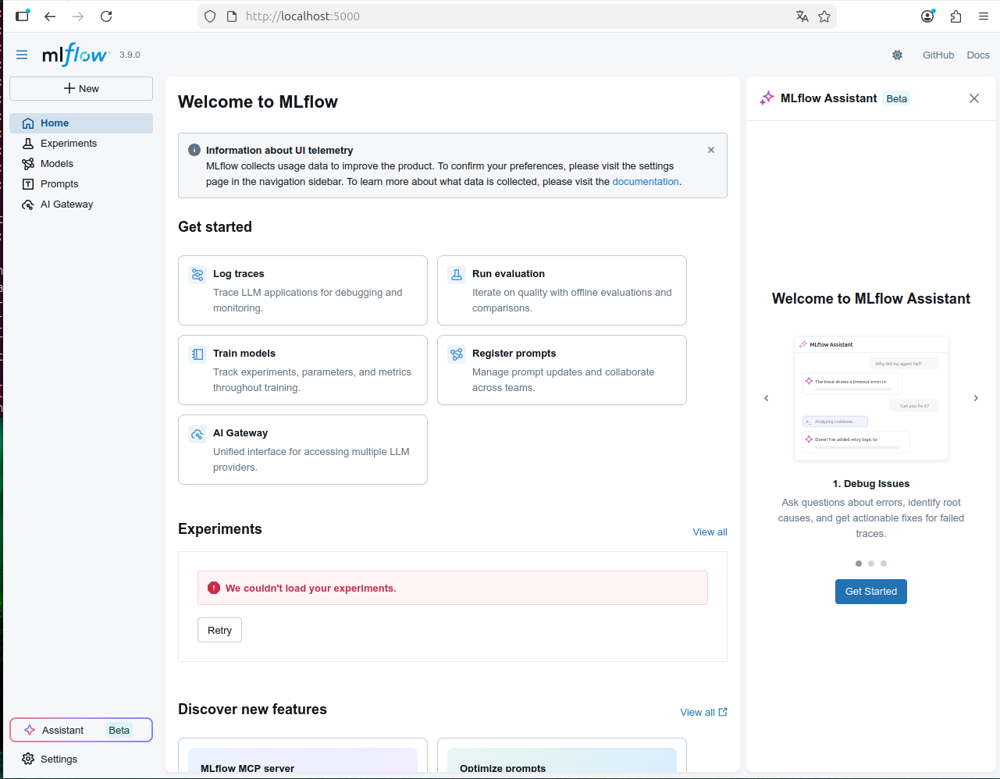

# ML Ops in a Box (Reproducible Experiments + Deployment Pattern)

**DE:** Dieses Repo zeigt ein „MLOps-Blueprint“: reproduzierbares Training (Seeds + Config), MLflow-Tracking, Artefakt-Export und ein minimales Serving via FastAPI.  
**EN:** This repo is a compact MLOps blueprint: reproducible training (seed + config), MLflow tracking, artifact export, and minimal serving via FastAPI.

<p>
  <strong>Author / Autor:</strong> Roger Seeberger (Swissbot)<br>
  
</p>

---

## What it demonstrates
- **Reproducible runs**: config + seed saved to `runs/...`
- **Experiment tracking**: MLflow local store (`mlruns/`)
- **Model export**: `models/latest/model.joblib` + `signature.json`
- **Serving pattern**: FastAPI `/health` + `/predict`
- **CPU-first**: runs everywhere in seconds (synthetic dataset, no private data)

---

## Project structure (important folders)
- `configs/` — Hydra configs
- `runs/` — run outputs (timestamped, config + summary) *(gitignored)*
- `mlruns/` — MLflow tracking store *(gitignored)*
- `models/latest/` — exported model + signature *(gitignored)*

---

## Setup (Ubuntu 24.04, Python 3.12)
```bash
make setup
```


## Runbook (What runs where)

This project runs **two web servers**:

- **MLflow UI** (experiment tracking): `http://localhost:5000`
- **Model API** (FastAPI serving): `http://localhost:8000`

## Screenshots

**MLflow UI (http://localhost:5000)**  


**Model API (http://localhost:8000)**  


Both commands are **blocking** (they keep running). Open the URL in your browser while the command is running.

---

## Quickstart (use two terminals)
Terminal 1 — MLflow UI (Tracking Dashboard)

Start the MLflow UI (this command keeps running):
```bash
make mlflow-ui
```
Open in your browser:

http://localhost:5000

Stop it with:

CTRL+C

Why does it print multiple “Started server process …” lines?
MLflow UI runs an internal FastAPI/Uvicorn server and typically starts multiple worker processes (e.g. --workers 4).
Seeing several “Started server process …” messages is expected and means the UI is running.

Terminal 2 — Train + Serve the model

Train a model (creates an MLflow run + exports models/latest/model.joblib):
```bash
make train
```

Start the API (this command keeps running):
```bash
make serve
```

# Artifacts written by training

After make train, you should have:

runs/<timestamp>/config.yaml

runs/<timestamp>/summary.json

models/latest/model.joblib

models/latest/signature.json

# Model API usage (FastAPI)
Health
```bash
curl -s http://localhost:8000/health
```
# Predict
Example with 30 features:
```bash
python - <<'PY'
import requests, random
X = [[random.random() for _ in range(30)] for _ in range(2)]
r = requests.post("http://localhost:8000/predict", json={"X": X})
print(r.status_code, r.json())
PY
```

# Screenshots
MLflow UI (http://localhost:5000
)


Model API (http://localhost:8000
)


# MLflow UI (manual command)
If you prefer the raw command (same as make mlflow-ui):
```bash
mlflow ui --host 0.0.0.0 --port 5000
```

# Config overrides (Hydra)
Override parameters without editing files:
```bash
mlbox-train seed=123 model.C=0.5 data.n_samples=5000
```

# Remote access (SSH tunnel)
If the project runs on a remote machine, tunnel ports:
MLflow UI:
```bash
ssh -L 5000:localhost:5000 ares@<host>
```
API:
```bash
ssh -L 8000:localhost:8000 ares@<host>
```

# Troubleshooting ports

Check what is listening on ports 5000/8000:
```bash
ss -ltnp | egrep '(:5000|:8000)'
```
# Stop running servers (only if needed):
```bash
pkill -f "mlflow ui" || true
pkill -f "uvicorn mlops_box.serving.app" || true
```
# License
Apache License 2.0

